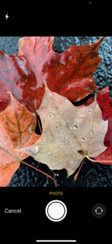

# Build a simple React-Native photo app in 30 minutes



## Introduction

I was recently working on a React-Native project where we needed to give the user the ability to include photos from either their library or take a photo with their device camera. I wanted to build the project with the Expo "Managed workflow" so I could test it wirelessly on my device. I found ImagePicker (expo-image-picker) but until I started looking at the API reference, I didn't realize it also allow you to use the camera in addition to picking an existing photo from the device library.

This tutorial will show you how to build a simple Expo Managed React-Native photo app. The app simply allows you to select a photo from your library or take a photo with the camera and then displays it on the main screen. It is intended to be a boilerplate to get you started building your own photo app.

To get started, we will need a React-Native project. You can follow these instructions to set up a project or create a React-Native project using Expo or your preferred method.

## Prerequisites

-   Some comfort using command-line tools.

-   Install the latest version of NodeJS on your development machine. Your development machine can be Windows, Linux, or macOS even if you are developing for an iOS device!

-   Make sure your mobile test device is on the same network as your development machine. Your mobile device will attempt to connect to your dev machine when you are ready to begin testing.

## Create your React Native project using Expo

### Why Expo?

Expo is a great way to get a React-Native project running on your mobile device without hard-wiring to your develop machine. Previously, if you were building a mobile application, you would have to connect a Lightning or USB cable between your development machine and your mobile device to test out your app on your mobile device. If you were developing an iOS app you would have to use a Mac running Xcode to get your app on your device. This is pretty silly considering both devices have a network connection. Expo offers an alternative.

### How does Expo work?

Expo has two parts:

-   **expo-cli** is a command-line, npm-installed, network service that runs on your development machine. It integrates with your project and makes it accessible by your mobile device on your local network.
    As long as your development machine is on the same network as your mobile device
-   **Expo Client** is an app available on iOS and Android.

Let's get start:

-   At a command-line use npm to install **expo-cli** on your machine. Use the "-g" switch to make it global.

    `npm install -g expo-cli`

-   Use the Expo to initialize a new React-Native project with Expo integration. Replace "MyProject" with the name of your project.

    `expo init MyProject`

-   Now start your project and make it available on your network to the Expo mobile app:

    `npm start`

## Add the expo-image-picker dependency to your project

-   Use npm to install ImagePicker:

    `npm install expo-image-picker`

## Add code to project to support ImagePicker

-   Open App.js and copy/paste the following code or copy the contents of App.js in this repo:

```import React, { useState, useEffect } from "react";

import { StatusBar } from "expo-status-bar";
import {
    StyleSheet,
    Text,
    View,
    SafeAreaView,
    Button,
    Image,
} from "react-native";
import \* as ImagePicker from "expo-image-picker";

export default function App() {
const [image, setImage] = useState(null);

    // From: https://docs.expo.io/versions/v39.0.0/sdk/imagepicker/
    useEffect(() => {
        (async () => {
            if (Platform.OS !== "web") {
                const {
                    status,
                } = await ImagePicker.requestCameraRollPermissionsAsync();
                if (status !== "granted") {
                    alert(
                        "Sorry, we need camera roll permissions to make this work!"
                    );
                }
            }
        })();
    }, []);

    // From: https://docs.expo.io/versions/v39.0.0/sdk/imagepicker/
    const pickImage = async () => {
        let result = await ImagePicker.launchImageLibraryAsync({
            mediaTypes: ImagePicker.MediaTypeOptions.Images,
            allowsEditing: true,
            allowsMultipleSelection: true,
            aspect: [4, 3],
            quality: 1,
        });

        console.log(result);

        if (!result.cancelled) {
            setImage(result.uri);
        }
    };

    // New code not in the ImagePicker example:
    const takePhoto = async () => {
        let result = await ImagePicker.launchCameraAsync({
            mediaTypes: ImagePicker.MediaTypeOptions.Images,
            allowsEditing: true,
            aspect: [4, 3],
            quality: 1,
        });

        console.log(result);

        if (!result.cancelled) {
            setImage(result.uri);
        }
    };

    return (
        <SafeAreaView style={styles.container}>
            <View style={styles.bodyContainer}>
                <Button title="Camera" onPress={takePhoto} />
                <Button title="Photo Library" onPress={pickImage} />
            </View>
            <View style={styles.bodyContainer}>
                {image && (
                    <Image source={{ uri: image }} style={{ width: "100%" }} />
                )}
            </View>
        </SafeAreaView>
    );

}

const styles = StyleSheet.create({
    container: {
        flex: 1,
        backgroundColor: "#fff",
        alignItems: "center",
        justifyContent: "center",
    },
});
```

## Start and test your project!

-   Install the "Expo Client" app from your device's appstore.

-   From a command line on your dev machine run:

    `expo init`

-   Expo init should launch a web browser and display a QR code at the command line and in the browser. On iOS devices scan the QR with the camera app or scan the QR code with the Expo Client app on Android devices.

-   If everything is working correctly, the Expo Client app should download your app from your dev machine and run it. You will be prompted to allow the app to use your camera and photo roll. Once you approve, you should see a link to start the camera and to take a photo and see it display in the app main screen or select a photo from the photo library.

## How does it work?

When you take a photo with the camera or select one from the library, that photo becomes available at a URI location. That URI location is stored in React state where it can be accessed by other components or passed as props. To display the image in your app, create an Image component and assign the uri to your selected image.

## What's next?

This is just a starting point for your photo app. You can continue to build a stand-alone app or copy/paste the code to leverage photos in your existing app.

### Here are some ideas:

-   Allow your users to take a photo of themselves for their avatar.
-   Upload the photo for analysis by various services such as AWS Rekognition or Azure Custom Vision to answer questions. I.e., Are the people in the photo wearing masks for eye protection? Is the user happy or sad? Is your company logo in the photo?
-   Allow the user add stickers to create their own meme.
-   Add sharing features so your user can share their photo on their favorite social network.
